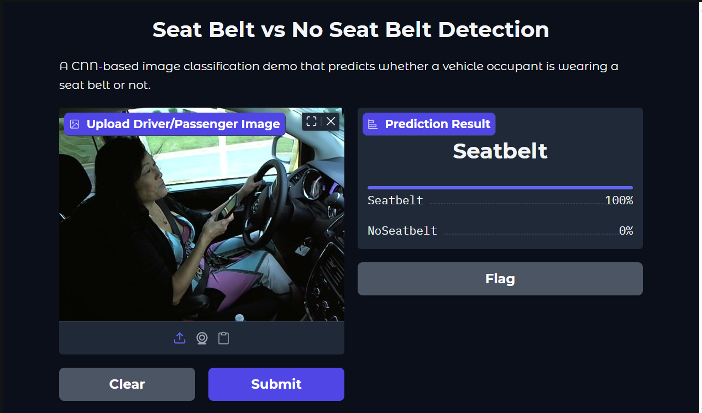
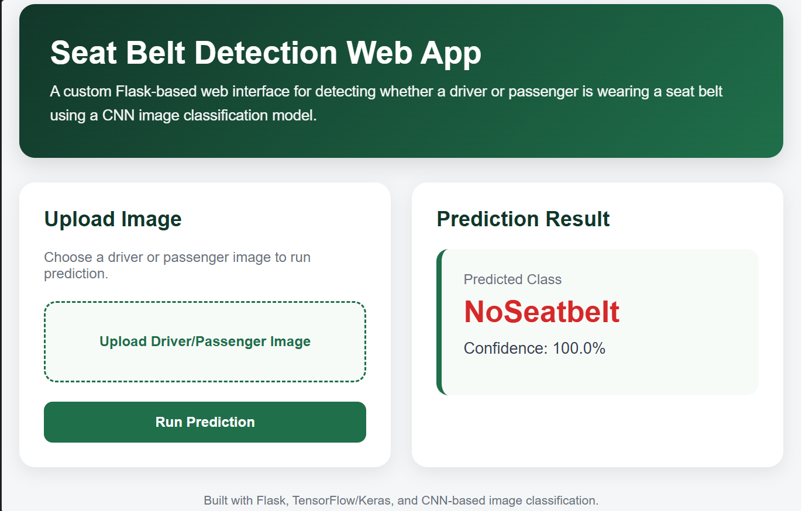
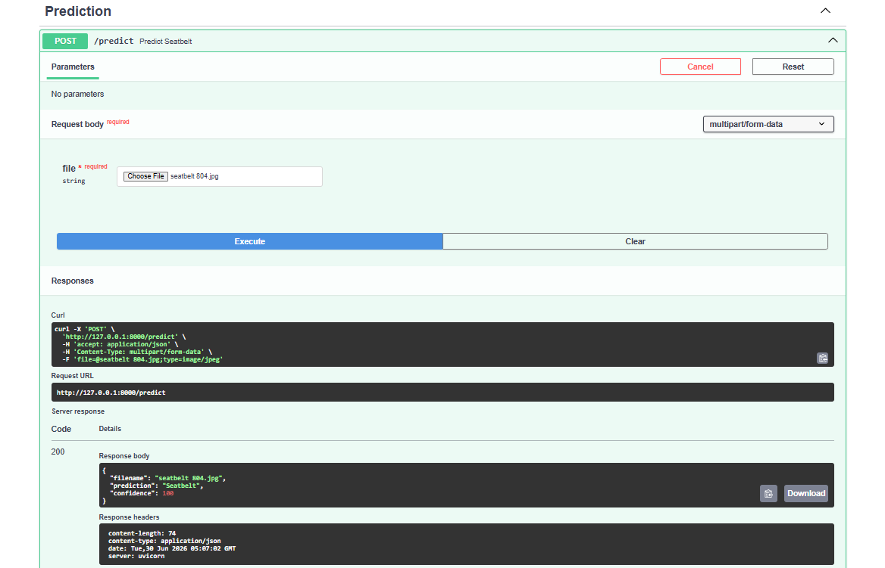

# Seat Belt vs No Seat Belt Detection System

## Project Overview

This project is a deep learning-based computer vision system that classifies driver or passenger images into two categories:

* Seatbelt
* NoSeatbelt

The purpose of this project is to demonstrate how a CNN-based image classification model can be used for driver safety monitoring. The trained model predicts whether a vehicle occupant is wearing a seat belt or not.

## Problem Statement

Seat belt usage is an important factor in road safety. Manual checking is not always scalable, so an automated image classification system can help detect seat belt usage from images.

This project uses a Convolutional Neural Network to classify images and provides different deployment/demo options using Gradio, Flask, and FastAPI.

## Tools and Technologies Used

* Python
* TensorFlow
* Keras
* Convolutional Neural Networks
* NumPy
* Pillow
* Gradio
* Flask
* FastAPI
* Uvicorn

## Project Workflow

1. Prepared image data for two classes: Seatbelt and NoSeatbelt
2. Preprocessed images by resizing them to 224x224 pixels
3. Normalized image pixel values by dividing by 255
4. Built and trained a CNN-based image classification model
5. Tested the model on sample images
6. Created a Gradio demo for quick model testing
7. Created a Flask web app for a custom user interface
8. Created a FastAPI backend API for JSON-based prediction response

## Model Approach

The project uses a Convolutional Neural Network because CNNs are effective for image classification tasks. CNN layers help the model learn visual features such as edges, shapes, textures, and object patterns from images.

The model takes an uploaded image as input and returns the predicted class along with a confidence score.

## Interfaces Included

### 1. Gradio Demo

Gradio is used for a quick machine learning demo interface. A user can upload an image and receive the prediction result directly in the browser.

### 2. Flask Web App

Flask is used to create a custom web application interface. The Flask app allows users to upload an image and view the prediction result in a clean web layout.

### 3. FastAPI Backend

FastAPI is used to expose the model as an API endpoint. The `/predict` endpoint accepts an uploaded image and returns the prediction result in JSON format.

## Repository Structure

Seat-Belt-Detector/

├── README.md
├── Gradio.ipynb
├── requirements.txt
├── project_summary.txt
├── Flask/
│   ├── app.py
│   ├── templates/
│   │   └── index.html
│   └── static/
│       └── style.css
├── FastAPI/
│   └── main.py
├── sample_images/
│   └── sample test images
└── screenshots/
├── gradio_demo.png
├── flask_web_app.png
└── fastapi_docs_prediction.png

## How to Run the Project

### 1. Install Required Libraries

```bash
pip install -r requirements.txt
```

### 2. Run the Gradio Demo

Open `Gradio.ipynb` in Jupyter Notebook or VS Code and run all cells.

### 3. Run the Flask Web App

```bash
cd Flask
python app.py
```

Then open:

```text
http://127.0.0.1:5000
```

### 4. Run the FastAPI App

```bash
cd FastAPI
python -m uvicorn main:app --reload
```

Then open:

```text
http://127.0.0.1:8000/docs
```

Use the `/predict` endpoint to upload an image and receive the prediction result.

## Output

The model returns:

* Predicted class: Seatbelt or NoSeatbelt
* Confidence score
* JSON response in FastAPI version

Example FastAPI response:

```json
{
  "filename": "seatbelt_sample.jpg",
  "prediction": "Seatbelt",
  "confidence": 100.0
}
```

## Screenshots

### Gradio Demo



### Flask Web App



### FastAPI Prediction API



## What I Learned

Through this project, I improved my understanding of:

* Deep learning for image classification
* CNN model workflow
* Image preprocessing
* TensorFlow/Keras model loading and prediction
* Gradio-based model demo
* Flask-based web interface development
* FastAPI-based backend API development
* Presenting AI/ML projects professionally on GitHub

## Note

The trained model file may not be included in this repository if it exceeds GitHub file size limits. In that case, the model can be shared separately or placed inside a `Models` folder as `cnn_model.h5` before running the project.
